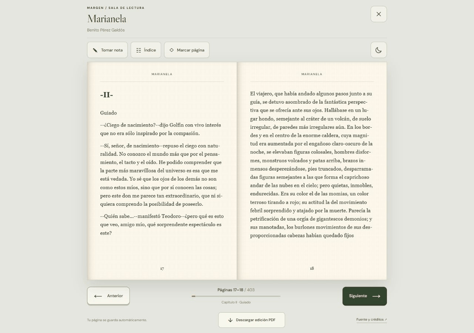
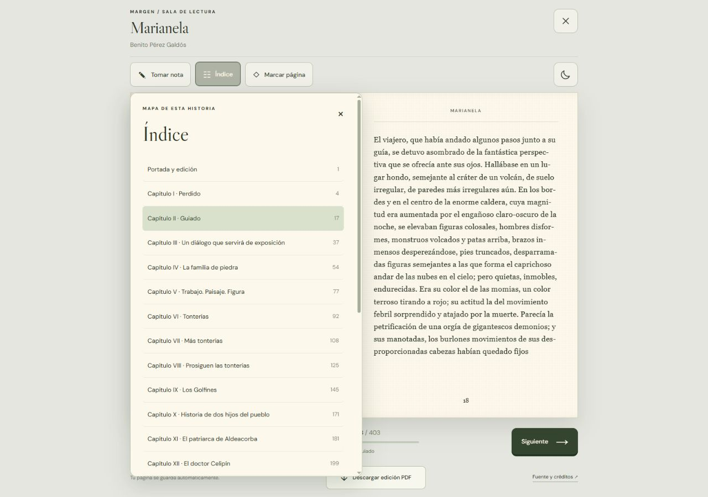
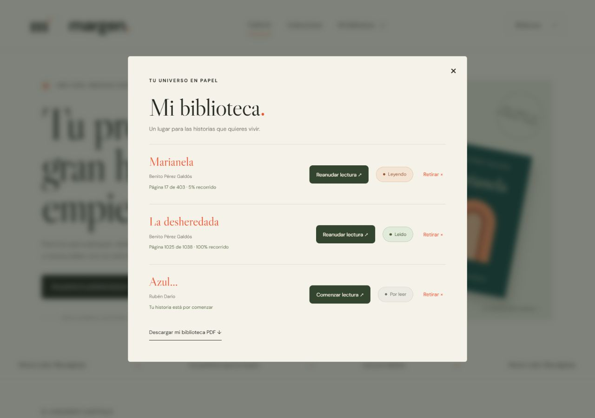
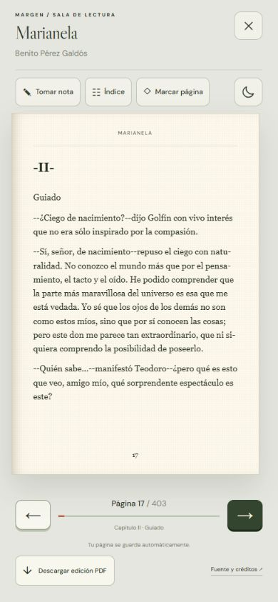

<p align="center">
  
</p>

<h1 align="center">Margen</h1>
<p align="center"><strong>Historias que se quedan contigo.</strong><br>Una biblioteca digital que transforma la lectura en una experiencia editorial.</p>
<p align="center">
  <a href="https://analizajech.github.io/Margen/">Explorar Margen</a> ·
  <a href="#lectura-en-movimiento">Ver la experiencia</a> ·
  <a href="#desarrollo-local">Ejecutar el proyecto</a>
</p>

**12 obras completas · Flipbook interactivo · PDF editorial · Biblioteca personal**

Margen reúne clásicos, narrativa, poesía, cuentos y teatro en una interfaz de papel, tipografía literaria y portadas originales. Puedes descubrir una obra, abrir su edición completa, guardar tu lugar y regresar a la historia cuando quieras. Funciona como una aplicación estática en GitHub Pages, sin servidor de aplicación ni cuentas.

## Lectura en movimiento



*Captura de la aplicación real. El giro funciona en ambas direcciones; en móvil, el libro se adapta a una sola página.*

## Una experiencia que acompaña al lector

| Función | Lo que aporta |
| :--- | :--- |
| **Descubrimiento editorial** | Búsqueda por título o autor, filtros por género, orden alfabético, selección por estado de ánimo y una obra sorpresa. |
| **Flipbook completo** | Papel con textura, giro animado, vista doble o individual, navegación con botones, teclado, clic y gestos horizontales. |
| **Índice navegable** | Capítulos en orden, partes diferenciadas y acceso directo al folio correspondiente. |
| **Tu lugar, guardado** | Progreso automático, marcador por obra y botón para reanudar desde la página guardada. |
| **Estados automáticos** | Badges Por leer, Leyendo y Leído según el avance; terminar la obra conserva el estado al releer. |
| **Bitácora contextual** | Notas vinculadas al libro y al folio. Guardarlas o cerrar la bitácora mantiene el lector abierto. Los borradores se conservan por obra. |
| **Ediciones PDF** | Libros completos con portada, tipografía incrustada, folios e índice PDF navegable. Comparten la paginación del lector. |
| **Biblioteca en PDF** | Catálogo personal de portadas vectoriales, progreso y enlaces clicables para abrir cada obra en la web. |
| **Lectura adaptable** | Tema claro y oscuro, controles accesibles y adaptación a pantallas de escritorio y móvil. |

## Dentro de Margen

### Descubrir


Una colección curada con identidad propia para cada edición y una presentación editorial común.

### Leer con contexto



La cabecera, los controles y el pie siguen el ancho real del libro. El índice permite recorrer la estructura de la obra sin perder el contexto de lectura.

### Construir tu biblioteca



Guarda libros con el corazón o empieza a leer para incorporarlos a tu biblioteca. **Reanudar lectura** vuelve al folio guardado; el estado se calcula automáticamente, sin cambios manuales.

<details>
<summary><strong>Ver la experiencia móvil</strong></summary>
<br>

</details>

## Identidad visual

**Margen** toma su nombre del espacio donde una lectura se convierte en una idea propia. Su identidad combina un símbolo tipográfico, fondos de papel cálido, tinta verde, acentos terracota y cubiertas geométricas. Libre Caslon Display aporta carácter editorial; DM Sans organiza la interfaz y Georgia acompaña el texto literario.

## Tecnología y arquitectura

| Capa | Implementación |
| :--- | :--- |
| Interfaz | React 19 y componentes personalizados |
| Desarrollo y compilación | Vite 7 |
| Movimiento del libro | StPageFlip (`page-flip`) |
| PDF de biblioteca | jsPDF, cargado cuando se solicita la descarga |
| Datos personales | `localStorage`, en el navegador del lector |
| Ediciones | JSON y PDF estáticos, incluidos en el repositorio |
| Generación editorial | Python y ReportLab; PyMuPDF para verificación |
| Publicación | GitHub Actions → GitHub Pages |

```text
Margen/
├── shell.jsx                 Interfaz editorial y diálogos
├── Reader.jsx                Sala de lectura y flipbook
├── app.js                    Catálogo, biblioteca y bitácora
├── reader-model.js           Progreso, estados y coordenadas de giro
├── library-pdf.js            Catálogo personal PDF y enlaces
├── catalog.json              Metadatos de las doce obras
├── styles.css / reader.css   Identidad visual y diseño adaptable
├── public/books/             Ediciones completas JSON y PDF
├── docs/media/               Capturas y GIF de la aplicación real
├── scripts/                  Generación y verificación editorial
└── .github/workflows/        Publicación automática
```

## Desarrollo local

Requiere **Node.js 22** y npm. Python solo es necesario para regenerar o verificar las ediciones; no participa en la compilación habitual del sitio.

```bash
git clone https://github.com/AnalizaJech/Margen.git
cd Margen
npm ci
npm run dev
```

Abre **http://127.0.0.1:4174**.

```bash
npm run build     # Genera dist/
npm run preview   # Revisa la compilación de producción
```

### Publicar en GitHub Pages

1. En el repositorio, abre **Settings → Pages**.
2. En **Build and deployment**, selecciona **GitHub Actions**.
3. Sube cambios a `master` o `main`, o ejecuta manualmente el workflow **Publicar Margen en GitHub Pages**.

El workflow instala las dependencias, compila y publica `dist`. Las rutas relativas permiten alojarlo bajo **`/Margen/`**. No necesitas PHP, una base de datos ni un servidor propio.

Los enlaces directos tienen la forma `https://analizajech.github.io/Margen/?libro=17340`. Los enlaces del PDF personal utilizan automáticamente el dominio y la ruta del sitio desde el que se descarga.

## Colección y fuentes

| Obra | Autor | Edición original |
| :--- | :--- | :--- |
| Don Quijote de la Mancha | Miguel de Cervantes | [Project Gutenberg #2000](https://www.gutenberg.org/ebooks/2000) |
| Marianela | Benito Pérez Galdós | [Project Gutenberg #17340](https://www.gutenberg.org/ebooks/17340) |
| La desheredada | Benito Pérez Galdós | [Project Gutenberg #25956](https://www.gutenberg.org/ebooks/25956) |
| Leyendas, cuentos y poemas | Gustavo Adolfo Bécquer | [Project Gutenberg #10814](https://www.gutenberg.org/ebooks/10814) |
| Cuentos de amor, de locura y de muerte | Horacio Quiroga | [Project Gutenberg #13507](https://www.gutenberg.org/ebooks/13507) |
| Pepita Jiménez | Juan Valera | [Project Gutenberg #17223](https://www.gutenberg.org/ebooks/17223) |
| Azul… | Rubén Darío | [Project Gutenberg #52894](https://www.gutenberg.org/ebooks/52894) |
| La Edad de Oro | José Martí | [Project Gutenberg #19898](https://www.gutenberg.org/ebooks/19898) |
| El sí de las niñas | Leandro Fernández de Moratín | [Project Gutenberg #50027](https://www.gutenberg.org/ebooks/50027) |
| Niebla | Miguel de Unamuno | [Project Gutenberg #49836](https://www.gutenberg.org/ebooks/49836) |
| Torquemada en la hoguera | Benito Pérez Galdós | [Project Gutenberg #15206](https://www.gutenberg.org/ebooks/15206) |
| El sombrero de tres picos | Pedro Antonio de Alarcón | [Project Gutenberg #29506](https://www.gutenberg.org/ebooks/29506) |

Los textos literarios están en español. Las ediciones anotadas de Bécquer y *El sombrero de tres picos* incluyen introducciones, notas y vocabularios en inglés. Las cubiertas son diseños de Margen y la paginación pertenece a esta edición digital, no a una edición comercial. Cada obra conserva sus créditos y la licencia de Project Gutenberg al final; sus condiciones corresponden a los textos de esas ediciones.

## Verificación

```bash
node scripts/verify_reader.mjs
python scripts/verify_editions.py
python scripts/verify_pdfs.py
```

- **Lector:** giro en ambas direcciones, migración del progreso y estados automáticos de lectura.
- **Ediciones:** correspondencia entre folios web y PDF, capítulos ordenados y esquemas PDF.
- **PDF:** renderizado de muestras y límites del texto; requiere PyMuPDF.
- **Interfaz:** comprobación en escritorio y móvil, reanudación de lectura, notas sin cerrar el libro y descarga real de PDF.

El generador comprueba que la paginación no pierda palabras.

### Regenerar las ediciones

```bash
python scripts/expand_catalog.py
python scripts/build_editions.py
```

La primera orden obtiene las fuentes y conserva los originales en `scripts/source-cache/`, excluido de la publicación. La segunda requiere ReportLab y las fuentes Georgia y Calibri de Windows. Los archivos publicados ya están generados: **`npm run build` no descarga ni repagina los libros**.

## Persistencia y alcance

La biblioteca, el avance, los marcadores, las notas y los borradores se guardan en el navegador. No hay cuenta ni sincronización entre dispositivos. Borrar los datos del sitio elimina esa información local. El PDF de biblioteca es una colección visual con enlaces; las notas permanecen en el navegador. Las fuentes externas tienen alternativas locales.

---

<p align="center"><strong>Menos ruido. Más páginas.</strong><br>Diseñado para leer, sin prisa.</p>
